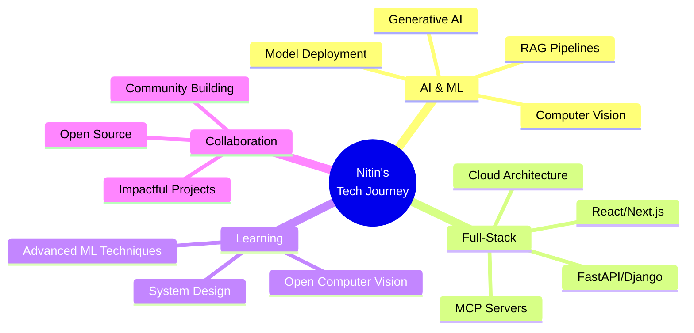

# 🌟 Nitin Mishra

<div align="center">

### GenAI Architect • AI Developer • Full-Stack Engineer

*Building the future with AI, one model at a time* 🚀

[](http://my-portfolio-nitinog10s-projects.vercel.app)
[](mailto:nitiniszod10@gmail.com)
[](https://linkedin.com/in/nitin-kumar-mishra-520615331)
[](https://instagram.com/nitinn10_)

📍 Bhopal, Madhya Pradesh, India

</div>

---

## 🎯 What I Do

```python
class NitinMishra:
    def __init__(self):
        self.role = "GenAI Architect & AI Developer"
        self.location = "Bhopal, India 🇮🇳"
        self.current_focus = "Open Computer Vision"
        self.collaboration = "Open to impactful projects"
        
    def get_expertise(self):
        return {
            "ai_ml": ["Generative AI", "RAG Pipelines", "ML Models", "Computer Vision"],
            "development": ["MCP Servers", "Full-Stack", "Scalable Systems"],
            "specialties": ["Intelligent Agents", "Production AI Platforms"]
        }
    
    def daily_routine(self):
        activities = [
            "☕ Coffee",
            "💡 Innovate with AI",
            "🔧 Build scalable systems",
            "📚 Learn something new",
            "🚀 Ship to production"
        ]
        return " → ".join(activities)
```

---

## 💼 Tech Arsenal

<details open>
<summary><b>🧠 AI/ML/GenAI Stack</b></summary>
<br>


**Specialized In:** RAG Pipelines • MCP Servers • Generative AI • Model Training & Deployment

</details>

<details>
<summary><b>🚀 Languages & Core</b></summary>
<br>


</details>

<details>
<summary><b>🎨 Frontend & UI</b></summary>
<br>


</details>

<details>
<summary><b>⚙️ Backend & Databases</b></summary>
<br>


</details>

<details>
<summary><b>☁️ Cloud & DevOps</b></summary>
<br>


</details>

---

## 📈 GitHub Analytics

<div align="center">


</div>

---

## 🏆 Achievements & Milestones

<div align="center">


</div>

---

## 🔥 Top Contributed Repos

<div align="center">


</div>

---

## 🎯 Current Focus



---

## 💡 Fun Facts

- 🎯 Specialized in building **production-ready AI systems**
- 🤖 Passionate about creating **intelligent agents** that solve real problems
- 🌱 Currently diving deep into **Open Computer Vision**
- 🚀 Always excited about **scalable architectures** and **clean code**
- 💬 Ask me about **GenAI, RAG Pipelines, or building MCP Servers**
- ⚡ Fun fact: I believe the best AI is the one that makes humans more creative!

---

## 📫 Let's Connect!

<div align="center">

**Open to collaborating on interesting & impactful projects!**

Whether it's AI innovation, full-stack development, or building the next big thing – let's make it happen! 🚀

[](http://my-portfolio-nitinog10s-projects.vercel.app)
[](mailto:nitiniszod10@gmail.com)

</div>

---

<div align="center">

### 💭 Quote of the Day

*"The best way to predict the future is to build it with AI"* ✨


**⭐ From [nitinog10](https://github.com/nitinog10) with 💙**

</div>
