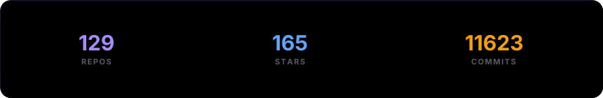

powered by <a href="https://github.com/collectioneur/readme-aura">readme-aura</a>

# 🌍 Hello! Hola! Namaskar! Ça va! Bonjour! Ciao! Olá! Nǐ hǎo!

**Let's get started.**

### Hi there 👋, I'm **Nitin Mishra**

**AI Engineer & Developer** | Bhopal, India  
*Open to high-agency AI product work.*

*I design agentic products, ML workflows, and full-stack experiences that turn research energy into software people can actually use.*

 

## 🎯 By the Numbers

  
  
  

 

## 🧠 Current Thesis

> **Systems thinking beats prompt theater.** Good AI work is product architecture, eval discipline, and interface clarity all at once.

### 🏗️ What I Build

* 🤖 **Agentic Products:** Agentic assistants and RAG products
* 🔬 **Applied ML Systems:** ML workflows and computer vision systems
* 💻 **Full-stack AI Interfaces:** Frontend surfaces that make AI usable

### 💡 Why Me?

*This is an AI engineer who can actually carry the build.*
I work where AI ambition usually falls apart: turning raw ideas into systems with clear interfaces, sane architecture, and enough product judgment to make the intelligence useful. I can move from model logic to shipped interface without losing the point of the product.

## 💼 Execution Mode (Experience)

*The value here is range with continuity. Each role reinforces the same pattern: step into ambiguity, structure the work, and carry it into something operational.*

| Role | Organization | Timeline | Highlights |
| :--- | :--- | :--- | :--- |
| **Co-Founder** | *BugBiceps.in* (India) | 2025 – 2026 | Product vision, AI strategy, startup execution to turn engineering topics into high-impact digital products. |
| **Head Alumni** | *SAC OIST* (Bhopal) | 2025 – 2026 | Led alumni coordination and mentorship opportunities for one of the largest campus student communities. |
| **Mentor (Open Source + Agentic AI)** | *GSSoC'2026* (Remote) | 2026 | Mentored contributors across open source and AI, focusing on shipping practical work and guiding execution. |
| **Intern** | *EntopLearning.com* | 2026 | Built foundational LMS modules focusing on backend performance, modularity, and scalable workflows. |
| **AI Developer** | *TechBus* (Bangalore) | 2025 | Engineered NLP-driven bots and integrated them into business workflows where accuracy and adoption mattered. |
| **AI and Tech Ops** | *Haron India* (India) | 2025 | Worked on GenAI-led internal ops strategy and execution for practical automation inside the organization. |

## 🏆 Recognition & Proof of Work

*Competitive environments sharpen product taste fast. External proof that the work lands in the room.*

* 🥇 **Winner - National Level Ideathon (2025)**: National-stage validation for problem framing, solution thinking, and presentation under pressure.
* 🌍 **NASA Space Apps Challenge (2025)**: Recognized for building a weather prediction solution grounded in NASA Earth observation data and machine learning.
* 🚀 **17+ Hackathon Finalist & 8-time Podium Finisher (2024–2026)**: Repeatedly shortlisted and recognized across fast-paced competitive builds, showcasing speed under pressure and rapid prototyping.

  <h3>Thanks for visiting!</h3>
  
   
  <i>"Comfortable in rooms where product, research, and engineering all want different things."</i>

